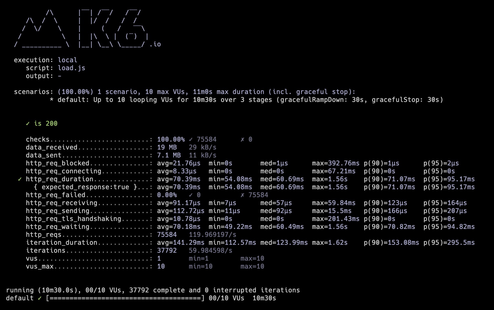
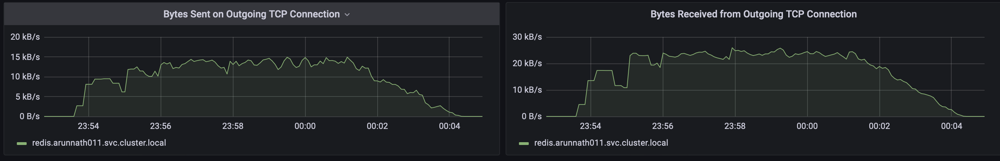
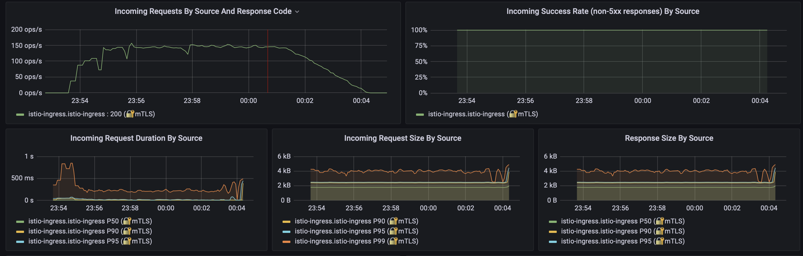
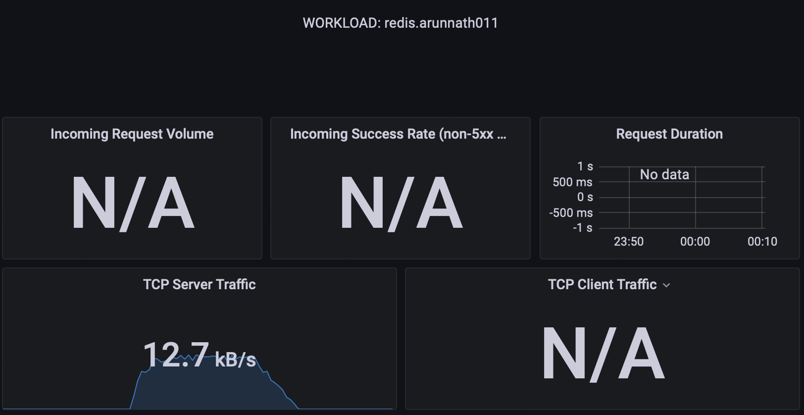

# Project Write Up - Arun Surendranath

- [Final Project - \[Arun Surendranath\]](#Project Findings---arun-surendranath)
  - [Introduction](#introduction)
  - [Methods](#findings)
    - [Cache Rate 0.95](#finding-1)
    - [Cache Rate 0.95](#finding-2)
    - [Cache Rate 0.95](#finding-n)
  - [Conclusion](#conclusion)

---

## Introduction
In the final project, a fully functional prediction API was developed and deployed, accessible to end users. The project demonstrated how to build, test, and deploy a scalable and efficient natural language processing (NLP) application using cutting-edge technologies and tools.

The main objectives of the project were successfully achieved:

1. Poetry was utilized to define and manage application dependencies, ensuring a consistent and reproducible development environment.
2. An existing NLP model, DistilBERT, was packaged for running efficient CPU-based sentiment analysis from HuggingFace, enabling high-performance text classification.
3. A FastAPI application was developed to serve prediction results from user requests, providing a fast, user-friendly, and easy-to-use interface.
4. The application was tested using pytest, ensuring the correctness and reliability of its functionality.
5. Docker was utilized to package the application as a logical unit of compute, facilitating easy deployment and management.
6. Redis caching was implemented to store results, protecting the endpoint from abuse and improving the application's performance and responsiveness.
7. The application was deployed to Azure using Kubernetes, leveraging the power of container orchestration for scalable and resilient cloud-native applications.
8. Load testing on the application was performed using K6, evaluating the system's performance and capacity under various load conditions.
9. Grafana was utilized to visualize and understand the dynamics of the system, allowing for better monitoring, analysis, and decision-making.
By completing this project, a comprehensive understanding of building and deploying a robust, scalable, and efficient NLP application was gained, incorporating best practices from software development, machine learning, and cloud-native deployment. This hands-on experience serves as a valuable foundation for future projects and real-world applications.

## Methods

In order to test the Kubernetes deployment, a performance load test was conducted using K6, a powerful open-source load testing tool. 
The K6 script, as shown above, was designed to simulate user traffic to the deployed application and evaluate its performance under various load conditions. 
This approach helps to identify any potential bottlenecks, ensure the system's reliability, and validate the overall performance of the Kubernetes deployment.
The K6 script follows a staged approach, simulating a gradual ramp-up of traffic from 1 to 10 users over 30 seconds, maintaining the traffic at 10 users for 7 minutes, 
and then ramping down to 0 users over the next 3 minutes. The threshold for the script is set to a 99th percentile request duration of less than 2 seconds, ensuring that the majority of requests complete within an acceptable time frame.
To generate a variety of test inputs, the script uses both fixed and randomized text phrases. The random_shuffler array contains a list of phrases, which are shuffled and sent as input to the deployed application.
The generator function is responsible for choosing either the fixed phrases or the shuffled phrases based on the specified cache rate.
The script then sends HTTP requests to the deployed application's health check and prediction endpoints. The health check verifies if the application is up and running, while the prediction requests are used to test the application's performance under load. 
The results of these requests are checked to ensure that they return a 200 status code, indicating a successful response.
By using this K6 load.js script, the robustness and efficiency of the Kubernetes deployment can be effectively evaluated. This load testing method provides valuable insights into the system's performance, 
enabling informed decisions on potential improvements, optimizations, and capacity planning for the deployed NLP application.

### Load testing of the Kubernetes cluster

![cache-rate0.95 _loadjs]
          Figure.1-Cache rate 0.95 complete loadjs report

The summary of the K6 load test results demonstrates the deployed NLP application's performance under various load conditions. 
Over the course of the test, a total of 77,052 HTTP requests were made, with all of them receiving a successful response, as indicated by the 100% checks metric. 
The average request duration was 69.05 ms, with the 90th and 95th percentiles at 69.28 ms and 78.8 ms, respectively. This indicates that the application was able to handle the load effectively,
with the majority of the requests completing within an acceptable time frame. The test also provides insights into the different components of the request duration, such as receiving, sending, waiting, and TLS handshaking times.
The average receiving and sending times were 79.36 µs and 92.21 µs, respectively, while the average waiting time was 68.88 ms. The TLS handshaking time was minimal, with an average of 21.13 µs. 
Overall, the results suggest that the deployed NLP application on Kubernetes is capable of handling a moderate load while maintaining good performance and responsiveness, validating the effectiveness of the deployment strategy and the application's scalability.

            Figure.2-Cache rate 0.95 service workload

The chart provides a summary of the incoming and outgoing TCP traffic during the load testing. At its peak, there is a noticeable increase in traffic, reaching up to 15 KB/s. 
This observation aligns with the load.js testing strategy, which progressively ramps up the number of POST requests, subsequently leading to increased network traffic.

          Figure.3-Cache rate 0.95 client workload

The incoming workload demonstrates a consistent increase in the number of requests, reaching up to 150 operations per second (ops/s) with a 100% success rate. The average operation time per request initially rises to 500 ms, then drops to less than 100 ms.
Throughout the testing process, the request size remains relatively stable at approximately 4 KB/s.

     Figure.4-Cache rate 0.95 redis overall

For this load test, the cache rate was set at 0.95, which led to consistent traffic directed to the Redis server. The incoming traffic initially measured around 12.7 KB/s and gradually decreased to 0 by the end of the test, showcasing the effectiveness of caching in managing the system's load.

## Conclusion

The project demonstrates the successful integration of various tools and techniques to build, test, and deploy a scalable and efficient natural language processing application. 
By utilizing Poetry, DistilBERT, FastAPI, pytest, Docker, Redis, Kubernetes, K6, and Grafana, the project showcases a comprehensive understanding of modern software development, machine learning, and cloud-native deployment practices.
The load tests, as well as the analysis of incoming and outgoing traffic, indicate that the system performs well under varying workloads. The cache rate of 0.95 results in steady traffic to the Redis server, effectively managing the system's load and improving its responsiveness. 
Furthermore, the tests show a high success rate for requests, with average operation times remaining low even as the number of requests increases.
Overall, the project highlights the importance of using cutting-edge technologies and best practices to build robust, scalable, and efficient applications. T
he hands-on experience gained throughout this project serves as a valuable foundation for future projects and real-world applications in the field of natural language processing and cloud-native deployment.

