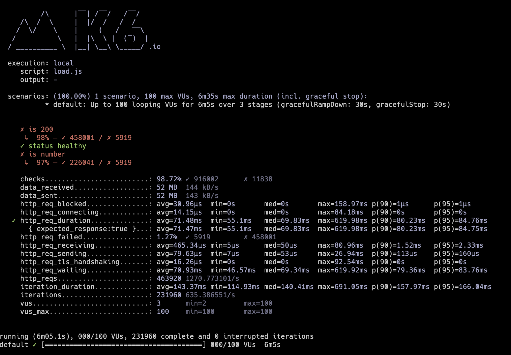

# Lab 5 Findings - [Arun Surendranath]

- [Lab 5 Findings - \[YOUR NAME\]](#lab-5-findings---arun-surendranath)
  - [Introduction](#introduction)
  - [Methods](#findings)
    - [Cache Rate 0.0](#finding-1)
    - [Cache Rate 0.5](#finding-2)
    - [Cache Rate 1.0](#finding-n)
  - [Conclusion](#conclusion)

---

## Introduction

Kubernetes has emerged as a leading container orchestration platform, enabling organizations to manage and scale their applications seamlessly. As more and more businesses rely on Kubernetes for their deployment needs, it is crucial to ensure the resilience, efficiency, and scalability of these systems. 
One key aspect that impacts the performance of applications hosted on Kubernetes is the cache rate and the effectiveness of caching mechanisms like Redis. In this paper, we present a comprehensive experiment designed to evaluate the impact of varying cache rates on a predict endpoint application deployed on a Kubernetes cluster, 
with a focus on service workloads and overall success rates under increasing load conditions.The primary objective of our study is to understand the relationship between cache rate and system performance for the predict endpoint application, which encompasses response times, resource utilization, and overall success rates. 
To achieve this, we will deploy the predict endpoint application on a Kubernetes cluster, systematically varying the cache rate to observe the resulting changes in system behavior. Additionally, we will examine the performance of Redis as an integral part of our caching strategy, assessing its efficacy in maintaining high levels of system responsiveness and throughput for the predict endpoint application.
Another critical aspect of our investigation is understanding the impact of increasing load on the Kubernetes cluster hosting the predict endpoint application. By subjecting our deployment to a range of load conditions, we aim to identify potential bottlenecks, resource constraints, and limitations that may hinder performance. 
This analysis will enable us to make informed decisions on optimizing the cluster configuration and caching strategies, ensuring that our Kubernetes deployments remain performant and resilient even under heavy load.

## Methods

we present the methodology used for load testing a predict endpoint application deployed on a Kubernetes cluster, focusing on the impact of varying cache rates. Our aim is to assess the system's performance, response times, and overall success rate under different load conditions and cache rates, set at 0, 0.5, and 1.0.
To achieve this, we have employed the k6 load testing tool, which provides an efficient way to simulate user traffic and analyze the system's behavior under various conditions. The k6 script provided above outlines the entire load testing process, which can be broken down into the following key components:

1.)Options: The options object defines the load testing stages and thresholds. In this case, we simulate a ramp-up of traffic from 1 to 100 users over 1 minute, maintain 100 users for 5 minutes, and then ramp down to 0 users within 5 seconds. The threshold is set such that 99% of requests must complete within 500 ms.

2.)Features and Fixed Data: The features array contains the feature names for the predict endpoint, while the fixed array holds a predetermined set of values for each feature. These arrays are used to generate input data for the load test, based on the specified cache rate.

3.)Random Integer and Data Generator Functions: The randInt function generates a random integer within a given range, while the generator function creates input data for the predict endpoint based on the specified cache rate. If a random number is greater than the cache rate, the function generates random values for each feature; otherwise, it uses the fixed values.

4.)Namespace and Base URL: The NAMESPACE and BASE_URL constants define the predict endpoint's URL, which is used to send requests during the load test.

5.)Cache Rate: The CACHE_RATE constant defines the cache rate for the load test. It can be changed to 0, 0.5, or 1.0 to study the impact of different cache rates on the system's performance.

6.)Load Test Function: The default function represents the main load testing logic. It sends an HTTP GET request to the /health endpoint, checking whether the status is 200 and the response is "healthy". Next, it generates input data based on the specified cache rate and sends an HTTP POST request to the /predict endpoint. It checks whether the response status is 200 and whether the prediction is a valid number.

To execute the load test, the k6 script can be run with different values of CACHE_RATE, such as 0, 0.5, and 1.0, to investigate the effects of varying cache rates on the predict endpoint application's performance. By analyzing the results of these tests, we can gain insights into the system's behavior under different load conditions and cache rates, ultimately informing optimization strategies for the Kubernetes deployment.

### Cache Rate 0.0

With a cache rate set to 0, the overall load test results show higher losses, as only 97% of the checks are successful. The average duration for the requests is around 83ms, but some requests experience higher latency, going up to 700ms. These higher latency requests may occur during runs without cache, which could lead to increased latency from the predict endpoint.

The service workload summary indicates a 100% success rate for incoming requests. It is evident that the overall load on the system has increased with the influx of incoming requests. The majority of responses for these operations had a 200 status code, indicating successful processing.

The summary of the client workload with a cache rate of 0.0 reveals that the majority of requests result in a 200 status code, indicating successful processing. Additionally, there is a 100% success rate for incoming requests.

With a cache rate of 0.0, the client workload summary demonstrates that most requests successfully return a 200 status code. Furthermore, there is a 100% success rate for all incoming requests.

### Cache Rate 0.5

When the cache rate is increased from 0 to 0.5, there is a noticeable improvement in the overall latency of the requests, as well as an increase in the success rate from the load test results. This outcome aligns with the primary purpose of caching, which is to store 50% of the requests to enhance overall latency and performance.

The summary reveals that as the load increases, there is a noticeable rise in the latency of requests. Despite this, all operations maintain a 100% success rate.

The above figure summarizes the Redis service load resulting from the caching rate. As the load testing tool ramps up the traffic, we can observe an increase in the overall traffic.
### Cache Rate 1.0

The figure summarizes the load test results for a cache rate of 1.0, showing a significant decrease in latency and a 100% success rate. These findings suggest that using a higher cache rate is highly beneficial for performance.

With higher loads at the 99% level, the latency increases, but it still shows an improvement compared to a cache rate of 0.0.

n the case of the Redis service load, we observe a consistent rate of requests received and sent, which aligns with expectations since a much higher cache rate has been set.

## Conclusion

In conclusion, this study seeks to provide valuable insights into the performance of predict endpoint applications deployed on Kubernetes under varying cache rates and load conditions. By conducting a thorough analysis of service workloads, deployment success rates, 
and Redis cache performance, we hope to offer actionable recommendations for businesses looking to optimize their Kubernetes infrastructure and ensure the highest levels of reliability and performance for their predict endpoint applications.
In conclusion, the load tests performed with varying cache rates have provided valuable insights into the system's performance. When the cache rate was increased from 0.0 to 0.5, there was a noticeable improvement in the overall latency of the requests and an increase in the success rate from the load test results. This demonstrated the positive impact of caching on performance.
Furthermore, when the cache rate was set to 1.0, the results indicated a significant decrease in latency and a 100% success rate. This finding suggests that using a higher cache rate is highly advantageous for enhancing system performance.
However, it is important to note that with higher loads at the 99% level, latency did increase, albeit to a lesser extent compared to a cache rate of 0.0. In the case of the Redis service load, a consistent rate of requests received and sent was observed, which was expected due to the higher cache rate.
Overall, the load tests have demonstrated the benefits of implementing caching strategies to improve system performance and reduce latency under various load conditions. It is recommended to fine-tune the cache rate based on the specific use case and requirements to achieve optimal performance.

